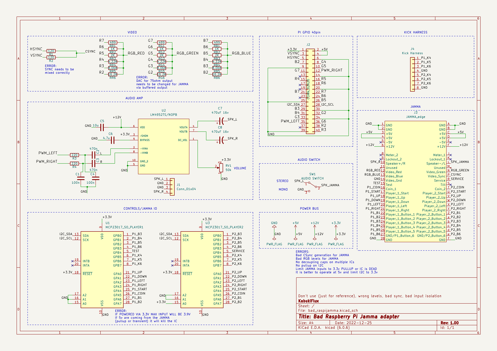

  <h1 align="center">BAD Raspberry PI to JAMMA adapter</h3>

## Table of contents

- [Description](#description)
- [Bugs and feature requests](#bugs-and-feature-requests)
- [Copyright and license](#copyright-and-license)

## Description

This is a very bad example of a Raspberry PI with 40pin GPIO to JAMMA adapter but it is a Christmas present and free to use.

It uses the VGA666 AD video converter for Video output, an LM4952TS as an audio amplifier (class D) and MCP23017 I2C chip for the JAMMA controls.

[MCP23017 I2C chip manual](https://www.mouser.es/datasheet/2/268/MCP23017_Data_Sheet_DS20001952-2998473.pdf)

[LM4952TS chip manual](https://www.ti.com/lit/ds/symlink/lm4952.pdf)

## Schematics

## Bugs and feature requests

Bugs and feature requests will be disabled as this is a bad example. If you want you can use it on your own risk.

### Errors

- Bad CSync generation for the JAMMA using a resitor signal mixer.
- Bad video levels as they have no buffer and the AD ladder is calculated to a 75ohm input, it works on 1k and 2k input monitors but very bad levels are expected.
- Most of the IC's don't have decoupling capacitors.
- No overvoltage prevention has been included on the design.
- The audio IC generates too much heat for a 3.1watt output.
- Lots of errors are expected as this is a draft.

## Copyright and license

Code and documentation copyright 2022. Code released under the [MIT License](https://github.com/KabukiFlux/bad_raspi_jamma/blob/main/LICENSE).

\
\
\

# MAL Adaptador Raspberry PI a JAMMA

## Tabla de contenidos

- [Descripción](#descripcion)
- [Bugs y peticiones de funcionalidades](#bugs-y-peticiones-de-funcionalidades)
- [Copyright y licencia](#copyright-y-licencia)

## Descripción

Este es un ejemplo muy malo de una Raspberry PI con 40pin GPIO a JAMMA adaptador, pero es un regalo de Navidad y de uso gratuito.

Utiliza el convertidor de vídeo VGA666 AD para la salida de vídeo, un LM4952TS como amplificador de audio (clase D) y el chip MCP23017 I2C para los controles JAMMA.

[MCP23017 I2C chip manual](https://www.mouser.es/datasheet/2/268/MCP23017_Data_Sheet_DS20001952-2998473.pdf)

[Manual del chip LM4952TS](https://www.ti.com/lit/ds/symlink/lm4952.pdf)

## Bugs y peticiones de funcionalidades

Bugs y peticiones de funcionalidades desactivados ya que este es un mal ejemplo. Si quieres puedes usarlo bajo tu propia responsabilidad.

### Errores

- Mala generacion de CSync para el JAMMA usando un mezclador de señales resistivo.
- Malos niveles de video ya que no tienen buffer y el conversor AD está calculado para una entrada de 75ohm, funciona en monitores de entrada de 1k y 2k pero se esperan niveles muy malos.
- La mayoría de los circuitos integrados no tienen condensadores de desacoplamiento.
- No se ha incluido ninguna prevención de sobretensión en el diseño.
- El circuito integrado de audio genera demasiado calor para una salida de 3.1W.
- Se esperan muchos errores ya que este es un borrador.

## Copyright y licencia

Código y documentación copyright 2022. Código publicado bajo la [Licencia MIT](https://github.com/KabukiFlux/bad_raspi_jamma/blob/main/LICENSE).

Traducción realizada con la versión gratuita del traductor www.DeepL.com/Translator